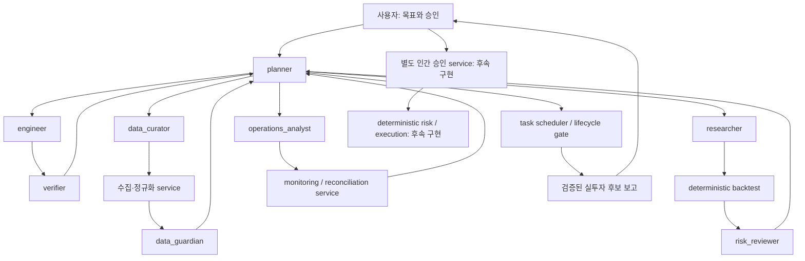
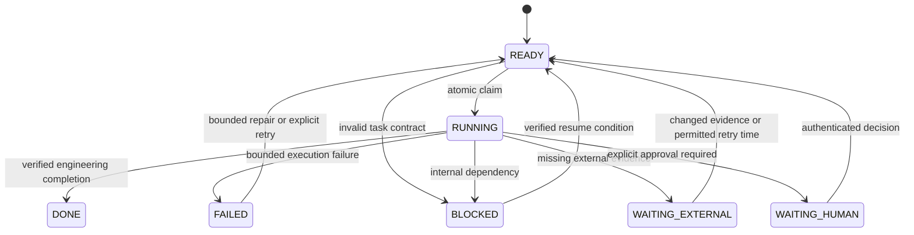

# Autonomous trading lab 설계와 적용 경계

기준: 2026-09-25, 분석 시작 `01d7901`. 이 문서는 현재 코드, 새 설계, 이번 최소 구현을 구분한다. 작업별 검증 결과는 [개발 기록](development-records/2026-09-25-autonomous-lab.md)에 남긴다. 투자 조건의 정본은 기존 [mandate](research-mandate.md)와 [로드맵](investment-development-roadmap.md)이며, 이 문서가 수익 목표·검증 기준을 완화하지 않는다.

## 1. 현재 구조

| 경계 | 재사용할 구현 | 현재 한계 |
| --- | --- | --- |
| 개발 자동화 | `development_runner.py`, `development_runner_store.py`, `development_runner_roadmap.py`, `development_runner_planning.py` | SQLite 큐·lock·bounded retry·fingerprint·completion 검증은 있다. task wait 종류와 구조화된 blocker가 부족하다. |
| 과거 자료 | `market_data_collector.py`, `market_history_sources.py`, `market_history_store.py` | source receipt·cache·정규화·coverage·PIT 계약은 있다. 실제 strict 공급자는 unavailable이며 부분 이력이 남아 있다. |
| 현재 자료 | `kis_stream.py`, `research_app.py`, 공시·뉴스 collector | 읽기 전용 시세와 증거 수집을 재사용한다. 원문은 비신뢰 입력이며 agent 지시로 실행하지 않는다. |
| 전략·백테스트 | `market_research_strategy.py`, `research_portfolio_engine.py`, `research_optimizer.py` | deterministic simulation, train/validation, walk-forward가 있다. optimizer 점수는 전체 투자 승인 절차를 대신하지 않는다. |
| 회계·위험 | `market_loss_accounting.py`, `research_risk.py`, 성과·비용 계약 모듈 | 계산·자료 완전성 검사 재사용. 계산 코드 통과와 실제 입력 완전성은 다르다. |
| 독립 검증 | `research_prospective_readiness.py`, `research_r7_gate.py` | prospective collector/input completeness가 아직 false인 경로가 있다. R7의 자동 승격 금지는 유지한다. |
| PAPER | `research_forward.py`, `operations_store.py` | 내부 가상체결·PAPER 원장·중복 보호가 있다. KIS 모의 서버 주문 체결을 뜻하지 않는다. |
| KIS | `kis.py`, `kis_stream.py`, `research_config.py` | 모의 host 설정·잔고·시세 조회는 있으나 조사한 경계에 모의 주문 제출 adapter가 없다. |
| 운영·UI | `research_app.py`, `operations_store.py`, Next.js 연구 화면 | 실행·제안 상태가 존재하지만 전략 전체 lifecycle과 같은 상태가 아니다. |

연구 실행기와 CUDA optimizer는 별도 프로세스다. timer가 active라는 사실은 새로운 코드 개발이나 유효한 투자 검증이 진행된다는 증거가 아니다. CPU/GPU 사용도 전략의 경제적 유효성을 의미하지 않는다. 새 agent framework, 백테스트 엔진, 금융 DB를 전면 재작성하지 않는다.

## 2. 자동개발이 멈추는 원인

1. **재현 가능한 선두 정체:** `_next_task`는 queued 항목을 고른 뒤 `run_once`에서 이미 완료되거나 사라진 roadmap area를 거절한다. 거절한 항목을 격리하지 않아 다음 cycle에도 같은 항목을 고를 수 있다. 기존 `_next_task` 자체는 blocked dependency와 미래 retry 시각을 건너뛰므로 모든 차단을 같은 결함으로 설명하면 안 된다.
2. **실행 가능한 공학 작업 부족:** `reserved_areas`는 blocked/failed checklist 전체를 예약하고 phase gate는 투자 자료 준비를 요구한다. fixture correctness나 실행기 개선도 이 영역만 사용하면 새 READY를 만들기 어렵다. 별도 명시적 engineering 작업 분류가 필요하다.
3. **공학 완료와 투자 미검증 혼합:** 많은 기술 slice는 이미 통과했지만 실제 coverage·권리·FX 자료를 기다리며 같은 checklist가 계속 blocked다. 기술 완료를 투자 성공으로 올리는 것도, 자료 부재 때문에 모든 코드 검증을 멈추는 것도 잘못이다.
4. **검토 호출 정체:** 2026-09-24 기록에 빈 receiver wait/spawn 정체가 있다. timeout 보호는 있지만 독립 검토 성공을 대신하지 않는다. host capability가 없으면 그 검토만 유한 상태로 남겨야 한다.
5. **정책 충돌:** 세션 문서는 외부 근거 부재를 전체 중단 조건으로 적었고 기한이 지난 창을 active로 표시했다. 과거 HANDOFF에는 최신 요청과 다른 shutdown·pause 기록이 남아 있다.
6. **실제 외부 한계:** 부분 가격 이력, historical observed_at, 배당 권리·완전체결·비용·FX 증거의 부재는 scheduler 수정으로 없어지지 않는다. 해당 투자 검증만 대기시킨다.

운영 DB의 분석 시점 snapshot은 투자 작업 blocked 8개, completed 12개, running 0개였다. 선두 정체 결함과 그날의 빈 READY 큐는 별도 관측이다. 현재 운영 정체 전체가 선두 결함 하나에서 발생했다고 주장하지 않는다.

## 3. 최종 역할

**8개 논리적 프로필, 동시 active 최대 4개(주 planner 포함).** 프로필 수는 프로세스 수가 아니다. 기존 `explore`, `plan`, `code`, `review` 역할에 bounded task를 전달하며 상주 모델 8개를 만들지 않는다. Astra는 역할 수를 늘리는 상시 agent가 아니라 선택적인 진단 모델이다.

| 프로필 | 주 기능 | 실행 역할 |
| --- | --- | --- |
| planner | 작업 선택·의존성·예산·구조 결정·후보 보고 조율 | 주 supervisor / `plan` |
| engineer | 구현·실행 가능 fixture·필요할 때 profiling | `code` / `code_small` |
| verifier | 구현자와 분리된 테스트 검토·회귀·경합·유지보수성 | `review` |
| data_curator | 과거/현재 자료 파이프라인의 수집 계획·장애 분석 | `explore`; 구현은 engineer |
| data_guardian | 품질·시점·coverage·누출·생존자 편향의 독립 검토 | `review` |
| researcher | 가설·경제적 근거·실험 설계·결과 해석 | `plan`; 계산은 deterministic service |
| risk_reviewer | 위험·비용·반증·stress·후보 검토 | `review` |
| operations_analyst | PAPER/실시간 평가·장애 원인 분석 | `explore` / `review`; 감시는 service |

## 4. 원래 18개 후보의 결정

| 후보 | 결정 | 이유와 도착점 |
| --- | --- | --- |
| kwl | 통합 | planner의 opportunity brief: 개발 시간, 기대 정보 증가, 기회비용. 별도 토론 agent는 증거 없이 토큰만 늘린다. |
| wife | 통합 | risk_reviewer의 downside brief: MDD, 변동성, 손실·비용. 인격 모사가 검증을 대신하지 않는다. |
| planner | 유지 | task 선택과 전체 흐름의 단일 책임자. |
| risk_manager | 통합 | red_team과 risk_reviewer. 전략 작성자와 독립성 유지. |
| architect | 통합 | 평상시 planner/engineer의 모듈 경계 책임. 중대한 변경만 독립 설계 검토. |
| implementer | 유지 | engineer로 명명. 복잡도에 따라 Sol/Luna 배정. |
| tester | 통합 | 기본 테스트는 engineer가 작성, 독립 검증은 verifier. 테스트 전담 상주 agent 불필요. |
| reviewer | 유지 | verifier. 자기 구현의 독립 승인을 금지. |
| perf_engineer | 통합 | engineer의 필요 시 역할. profiler 증거가 있을 때만 호출. |
| past_scanner | 통합·분리 | data_curator에 통합하되 batch historical service와 저장 경로는 유지. |
| now_scanner | 통합·분리 | data_curator에 통합하되 streaming service, quota, freshness 경계는 과거 자료와 분리. |
| data_guardian | 유지 | 수집자·전략 연구자로부터 독립된 data gate. |
| strategy_researcher | 유지 | researcher. hypothesis와 economic rationale의 소유자. |
| backtester | 통합 | 연구 설계/해석은 researcher; 수익 계산은 기존 deterministic engine/tool. |
| red_team | 통합 | risk_reviewer의 공격적 반증 역할. |
| simulator | 통합 | 운영 분석은 operations_analyst; KIS paper 실행은 향후 deterministic adapter. |
| live_monitor | 분리·통합 | 상시 감시는 deterministic service, 사건 분석만 operations_analyst. |
| recommender | 통합 | planner가 검증된 evidence만으로 보고. risk/data 검토 없이 후보 발행 불가. |
| task scheduler / lifecycle registry | 신규 추가, 비-LLM | 상태·재시도·claim·전이를 결정론적으로 강제할 service 책임. |

## 5. Agent별 상세 specification

각 프로필은 다음 16개 계약을 따른다. 모든 출력에는 task/attempt ID, 입력·정책·코드 hash, 산출물 위치, 판정·한계를 포함한다. 본문에 raw price 전체·credential·긴 대화 이력을 복사하지 않는다. 도구가 수행한 계산을 agent가 임의 수정하지 않는다.

### planner

1. 책임: 목적을 bounded task로 분해하고 READY 선택, 의존성·예산·우선순위·통합·보고를 관리한다.
2. 금지: 실제 주문, 자기 승인, 투자 게이트 우회, 일 없는 agent 유지, 동일 blocker 무한 재확인.
3. 입력: 사용자 mandate, task snapshot, evidence manifest, 서비스 상태, 예산 ledger.
4. 출력: 작업 지시·선택 사유·구조화된 blocker·후보 보고·인계. 후보 보고에는 반증도 포함한다.
5. 도구/service: RunnerStore/runner CLI, Git, pytest 결과, lifecycle service의 제한된 인터페이스.
6. 통신: 모든 프로필과 작업 단위로 통신한다. 승인 필요 정보만 사용자에게 전달한다.
7. 호출: 새 목표·task 완료/실패·dependency 변경·유한 retry 기한·운영 사건.
8. BLOCKED: 특정 계획에 필수 계약이 없거나 공통 저장소/정책 무결성을 확인할 수 없다.
9. 대안: 자료와 무관한 engine 테스트, 큐/회귀 개선, 이미 준비된 가설·다른 시장의 독립 작업.
10. 완료: 실행 가능한 다음 task를 claim했거나, READY 없음과 각 대기 재개 조건을 기록했다.
11. 독립 검토: 중요한 구조·투자 후보·권한 변경에는 필요하다. 일상적 일정 선택에는 불필요하다.
12. 모델: Sol.
13. effort: medium; 복잡한 DAG/구조 결정만 high.
14. 병렬: planner는 하나. 독립 작업자 최대 셋; 통합은 직렬.
15. ownership: 작업 등록부·설계·통합 Git; task DB는 deterministic store만 쓴다.
16. escalation: 독립 Sol 검토 후 근거 있는 Astra 1회 선택; 불가하면 해당 결정 보류, 다른 READY 실행.

### engineer

1. 책임: 확정한 계약을 최소 코드 변경으로 구현하고 회귀 테스트·필요한 profile을 만든다.
2. 금지: 전략 성과 판정, 자기 독립 검토, 공유 main/운영 DB 직접 변경, 증거 없는 최적화.
3. 입력: bounded 계획, 소유 파일, 기준 SHA, 재현 fixture, 완료 기준.
4. 출력: patch/commit, red-green 증거, 검사 결과, 호환·rollback 설명.
5. 도구/service: apply_patch, Git worktree, pytest, Ruff, mypy, 필요한 경우 profiler.
6. 통신: planner와 verifier; 데이터/전략 계약 질문은 planner를 통해 해당 소유자에게 전달.
7. 호출: 재현된 결함이나 확정한 기능 slice; 성능 작업은 측정된 병목이 있을 때.
8. BLOCKED: 입력 계약 모호, 필요한 dependency 미완료, 소유권 충돌, 필수 환경 복구 실패.
9. 대안: planner는 다른 파일의 회귀/fixture 작업, 독립 검토, 데이터 source audit을 선택한다.
10. 완료: 관련 검사와 독립 review 통과, local main 통합·검증·기록. 투자 검증을 뜻하지 않는다.
11. 독립 검토: 상태·DB·계산·실행·공유 API 변경에 필수.
12. 모델: 복잡한 변경 Sol; 좁고 반복적인 변환 Luna.
13. effort: high; 단순 반복은 medium을 명시적으로 선택할 수 있다.
14. 병렬: 파일/출력/DB 겹침이 없는 다른 engineer와 가능; 같은 task 구현 소유자는 하나.
15. ownership: 지정 worktree 파일과 전용 테스트 DB·artifact만 소유.
16. escalation: Luna 실패는 Sol; Sol의 서로 다른 두 가설 실패는 독립 진단, 필요 시 Astra 1회.

### verifier

1. 책임: correctness, race, side effect, 경계조건, 회귀와 유지보수성을 독립 검토한다.
2. 금지: 검토 중 제품 코드 수정, 구현자 결과의 무검증 승인, fixture를 경제 성과로 해석.
3. 입력: 고정 diff/SHA, 요구 계약, red-green 결과, 실행 가능한 격리 fixture.
4. 출력: 심각도·위치·재현·수정 조건, PASS/FAIL/UNAVAILABLE, 검토한 SHA.
5. 도구/service: read-only Git, rg, pytest/타입 검사, 격리 DB의 비파괴 재현.
6. 통신: planner에 결과; 구현 수정은 원래 engineer가 담당.
7. 호출: 의미 있는 구현 완료, 계약 변경, 통합 후 새로운 상호작용 발생 시.
8. BLOCKED: diff 불안정, 최소 환경·fixture 부재, 자기 작성 코드라 독립성 불충족.
9. 대안: planner는 다른 완료 diff 검토, 환경 복구 task, 별도 소유 파일의 구현을 선택한다.
10. 완료: 요청 계약마다 증거와 미해결 지적을 남기고 중요 지적이 해소됐는지 확인한다.
11. 독립 검토: 이 프로필 자체가 독립 검토다. 고위험 분쟁만 두 번째 검토를 요청한다.
12. 모델: Sol.
13. effort: high; 작은 비금융 diff만 medium.
14. 병렬: 구현 완료 SHA에 고정해 다른 독립 작업과 가능; 수정 중인 diff를 최종 승인하지 않는다.
15. ownership: 검토 artifact/격리 재현 출력. 제품 파일·운영 DB 쓰기 권한은 작업상 부여하지 않는다.
16. escalation: engineer 수정과 재검토; 핵심 의견 충돌은 planner가 독립 Sol/Astra 진단으로 조정.

### data_curator

1. 책임: 필요한 자료의 범위·원천·quota·수집 시점과 ingestion 실패를 분석한다.
2. 금지: 결측 합성, 현재 universe 소급, entitlement 우회, 유료 전환·credential 완화, 수동 SQL 적재.
3. 입력: 기간/시장/종목 계약, source manifest, quota·entitlement 상태, missing diagnostics.
4. 출력: bounded 수집 계획·source 대안·수집 tool receipt·coverage와 실패 분류.
5. 도구/service: 기존 collector/cache, Nasdaq/Alpha/SEC adapters, KIS read-only stream, 검증된 parser.
6. 통신: planner, data_guardian, researcher; 코드 수정은 engineer에게 전달.
7. 호출: 새로운 데이터 계약·missing 구간·provider 오류·freshness 사건 발생 시.
8. BLOCKED: source 없음/권한 없음/지속 quota·network 실패. 외부 실패는 WAITING_EXTERNAL로 분류한다.
9. 대안: planner는 cached fixture correctness, 다른 무료 source의 bounded probe, 독립 시장/가설 작업.
10. 완료: source receipt와 coverage가 보존되고 한계가 명시됐다. complete coverage를 보장하지 않는다.
11. 독립 검토: 연구 입력 승격 전 data_guardian 필수.
12. 모델: Luna; 복잡한 source contract 충돌만 Sol.
13. effort: medium; 복잡한 parser/시간 계약 분석 high.
14. 병렬: source별 quota/출력 namespace가 독립일 때 가능. 실시간 stream은 별도 service.
15. ownership: 수집 request/manifest 계획; 실제 raw/staging DB 쓰기는 collector service만 수행.
16. escalation: 소유 환경 복구, 대안 source, planner의 WAITING_EXTERNAL; 계정 entitlement 결정만 사용자.

### data_guardian

1. 책임: provenance, 시점 가용성, corporate actions, coverage, look-ahead/survivorship 검증.
2. 금지: 원본 수정, 전략 결과에 맞춘 제외, 부실 자료 등급 상향, 수집자의 자기 인증 수용.
3. 입력: immutable snapshot·receipt·달력·universe/기업행사 계약과 strategy cutoff.
4. 출력: machine-readable data gate, 문제 구간, 재현 테스트·hash, 자료 등급.
5. 도구/service: 기존 readiness/PIT/calendar validator와 prefix-invariance tests.
6. 통신: planner, data_curator, researcher, risk_reviewer.
7. 호출: 새 snapshot/계약, BACKTESTED 이상 단계의 입력 변경, 관측 anomaly.
8. BLOCKED: 필수 source receipt·timestamp·범위 증명 없음 또는 검증 도구 불완전.
9. 대안: planner는 validator fixture 개발·다른 완료 snapshot 검증·engine correctness를 선택한다.
10. 완료: PASS/FAIL/UNAVAILABLE가 자료 hash에 결속됐다. 부족한 증거는 그대로 남긴다.
11. 독립 검토: 수집·전략 작성자와 별도 실행. 고위험 누출 발견은 verifier/risk_reviewer 교차 확인.
12. 모델: Sol; 고정 체크리스트 대량 요약만 Luna.
13. effort: high; 반복적 증거 정리 medium.
14. 병렬: immutable 입력에 대해 가능. 해당 입력이 수정되면 검토를 무효화한다.
15. ownership: data gate artifact만. raw data·정규화 DB·전략 코드를 직접 고치지 않는다.
16. escalation: source 보완은 curator, validator 결함은 engineer, 복잡한 누출 분쟁은 독립 진단.

### researcher

1. 책임: 가설·경제적 이유·baseline·반증 조건을 정의하고 사전등록된 실험을 설계·해석한다.
2. 금지: authoritative 수익률 수기 계산, holdout retuning, data mining 은폐, 기준 사후 변경.
3. 입력: mandate, data readiness, baseline, 이전 실험 ledger, 비용·계산 계약.
4. 출력: hypothesis/pre-registration, bounded 실험 요청, tool 결과 해석, 다음 반증 또는 폐기 근거.
5. 도구/service: 기존 deterministic backtest/optimizer/성과 도구, immutable experiment artifacts.
6. 통신: planner, data_guardian, risk_reviewer, 구현이 필요하면 engineer.
7. 호출: READY 가설 또는 새로 충족된 자료 의존성. 시장 tick마다 LLM을 호출하지 않는다.
8. BLOCKED: 실제 검증 자료·비용 계약 없음, experiment budget 소진, holdout 이미 소비됨.
9. 대안: planner는 synthetic engine 테스트, 이론적 가설 정리, 다른 사전등록 실험 또는 수집 작업.
10. 완료: 사전등록 조건으로 결과·실패까지 보존하고 engineering/investment 판정을 분리한다.
11. 독립 검토: data_guardian과 risk_reviewer 통과 없이 다음 투자 단계로 승격하지 않는다.
12. 모델: Sol; 반복적 결과 표 정리는 Luna.
13. effort: high; 기존 실험 비교 요약 medium.
14. 병렬: 독립 가설·고정 budget·출력 경로일 때만; 같은 holdout의 적응적 반복은 금지.
15. ownership: hypothesis와 실험 계약. 실험 DB 적재·가격·수익 계산은 service 소유.
16. escalation: 코드 실패는 engineer, 자료는 curator, 가설 실패는 RETIRED/새 hypothesis로 기록.

### risk_reviewer

1. 책임: downside와 비용, stress·반증, 과적합, tail risk, 후보 적합성을 독립 검토한다.
2. 금지: 한도 완화, 전략 작성자의 자기 승인 대행, 수익 보장, 주문 전송.
3. 입력: 사전등록·data gate·IS/validation/WFA/OOS·비용 포함 지표·stress/PAPER 증거.
4. 출력: 위험 보고·가장 강한 반증·기준별 판정·후속 검사, 후보 승인 권고 또는 거절.
5. 도구/service: deterministic risk/stress/accounting/R7 gates; 계산 결과를 임의 변경하지 않는다.
6. 통신: planner, researcher, data_guardian, operations_analyst.
7. 호출: ROBUSTNESS_TEST, PAPER_READY, REAL_MONEY_CANDIDATE 전 및 위험 사건.
8. BLOCKED: 유효한 OOS/비용/미래 관찰 증거 없음, 리뷰 독립성 없음.
9. 대안: planner는 stress harness correctness, 다른 전략 검토, paper 재연결 테스트를 선택한다.
10. 완료: 입력 hash에 결속한 판정·독립 검토 근거와 미해결 위험을 남겼다.
11. 독립 검토: 연구자와 반드시 분리. 실제 자금 후보 직전에는 별도 최종 검토가 추가로 필요하다.
12. 모델: Sol; 최종 고위험 판단에서만 Astra 후보.
13. effort: high; Astra 선택 시 xhigh.
14. 병렬: immutable 실험을 대상으로 가능; 동일 전략 연구자와 결론을 미리 맞추지 않는다.
15. ownership: risk/review evidence. risk limit DB·mandate·execution 정책은 직접 수정하지 않는다.
16. escalation: 서로 다른 근거의 중대 충돌은 독립 최종 검토. Astra 불가 시 다른 Sol, 해결 전 후보 보류.

### operations_analyst

1. 책임: PAPER 실시간 성능·데이터·PnL·오류·체결 대사를 분석하고 장애 대응 작업을 제안한다.
2. 금지: 직접 주문·수동 원장 조작·LIVE 승인·자기 판단으로 계정 전환·credential 출력.
3. 입력: service telemetry, order/execution audit, paper ledger, data freshness, 기대 위험 한도.
4. 출력: 사건 분류·재현 조건·실시간 성능 보고·복구 task·중단 권고.
5. 도구/service: read-only monitoring, deterministic reconciliation, sandbox replay, 향후 KIS paper adapter 상태.
6. 통신: planner, engineer, data_curator, risk_reviewer.
7. 호출: threshold/event, 일별 요약 또는 paper 평가 창 종료. 평상시 감시는 service가 맡는다.
8. BLOCKED: telemetry/receipt 없음, broker 장애·권한 없음, 사전 승인 없는 외부 조치 필요.
9. 대안: planner는 replay·중복/부분체결 fixture·다른 연구를 진행한다. 계정 재전송은 하지 않는다.
10. 완료: 사건·PnL 대사·실패 원인과 재개 조건이 기록되고 service 결과로 복구를 확인했다.
11. 독립 검토: 성능 평가/후보 보고는 risk_reviewer; 실행 코드 변경은 verifier.
12. 모델: Luna; 주문 상태·회계 경합 분석은 Sol.
13. effort: medium; 원인 불명 장애 high.
14. 병렬: read-only 분석은 가능. 주문/원장 writer는 account별 하나이며 LLM이 아니다.
15. ownership: incident/report artifact. DB 적재·회계·order state는 deterministic service 소유.
16. escalation: service circuit breaker/engineer, 원인 불명 중요 장애는 독립 Sol 후 선택적 Astra; 위험 조치는 사용자 승인.

## 6. 통신 graph

task envelope는 `task_id`, `attempt_id`, `parent_task_id`, `kind`, `input_refs`, `ownership`, `acceptance`, `budget`, `deadline`, `state`를 가진다. 결과는 `artifact_refs`, `engineering_status`, `investment_status`, `blocker`, `next_task_candidates`로 전달한다. agent 간 자유 토론 대신 versioned artifact를 전달한다. 코드 변경은 planner가 지정한 단일 소유자에게 반환한다. lifecycle 승인 근거는 agent의 자연어 결론이 아닌 검증된 service receipt다.

## 7. Task state machine

`READY`는 미완료와 동의어가 아니다. 의존성·권한·필수 입력·resource lease·retry 시각을 충족해야 claim한다. 기존 소문자 `queued/running/blocked/failed/completed`는 호환 저장 표현으로 유지할 수 있고 canonical state를 별도 출력한다. `interrupted/retryable`은 FAILED 계열이며 이전 attempt를 지우지 않는다. 상태 전이는 단일 store transaction으로 처리한다.

과거 일반 `research` scope에는 blocked 선행 작업을 terminal 순서 조건으로 인정하는 호환 경로가 있다. 이를 새 자료 검증 통과로 해석하지 않는다. investment-roadmap과 그 engineering lane의 필수 선행 작업은 DONE이어야 하며, 이전 scope의 실행 의미를 자동 변경하거나 새 투자 증거로 재분류하지 않는다.

`ENGINEERING_COMPLETE`와 `INVESTMENT_VALIDATED`는 task state에 섞지 않는 별도 판정 축이다. fixture로 deterministic backtest correctness를 검증한 task는 `DONE + ENGINEERING_COMPLETE + NOT_EVALUATED`가 가능하다. 투자 검증은 real evidence와 독립 gate를 통과한 해당 strategy version의 판정이며, task DONE이나 checklist checkbox에서 추론하지 않는다.

## 8. Strategy state machine

```mermaid
stateDiagram-v2
  state Active {
    [*] --> IDEA
    IDEA --> RESEARCHING
    RESEARCHING --> BACKTESTED
    BACKTESTED --> ROBUSTNESS_TEST
    ROBUSTNESS_TEST --> PAPER_READY
    PAPER_READY --> PAPER_TRADING
    PAPER_TRADING --> REAL_MONEY_CANDIDATE
    REAL_MONEY_CANDIDATE --> HUMAN_APPROVED
    HUMAN_APPROVED --> LIVE
  }
  Active --> PAUSED: RESEARCHING or later; record prior state
  PAUSED --> Active: restore exact prior state after fresh gates
  Active --> RETIRED: retain evidence and reason
  PAUSED --> RETIRED
```

`Active`는 그림의 묶음이며 DB 상태가 아니다. IDEA는 RESEARCHING 또는 RETIRED로만 이동하고 pause 대상이 아니다. resume은 IDEA부터 다시 시작하거나 원하는 상태를 고르는 동작이 아니라 기록된 직전 상태만 재검증해 복원한다. 미구현 전이는 resume 경로에서도 차단한다.

| 전이 | 필수 증거 / deterministic guard |
| --- | --- |
| IDEA → RESEARCHING | hypothesis/version, economic rationale, preregistration/계산 예산 |
| RESEARCHING → BACKTESTED | 실제 자료 provenance/data gate, 고정 engine/input/policy hash, 비용 포함 bounded IS 및 validation 결과 |
| BACKTESTED → ROBUSTNESS_TEST | hard filter, WFA, 단회 untouched OOS의 사전등록 기준 통과 |
| ROBUSTNESS_TEST → PAPER_READY | stress·격리 simulation·독립 data/risk/code review, 기존 R7 및 PAPER 계약 |
| PAPER_READY → PAPER_TRADING | 별도 PAPER 결정·KIS 모의 환경 확인·중복/재시도/대사 보호·실제 모의 session receipt |
| PAPER_TRADING → REAL_MONEY_CANDIDATE | 사전 고정한 실제 paper 관측 창과 최소 거래/운영 표본, 비용/체결/PnL 대사, 독립 최종 위험 검토 |
| REAL_MONEY_CANDIDATE → HUMAN_APPROVED | 전략·코드·자료·계정 scope·금액·위험 한도·만료 시각에 결속한 인증된 인간 승인 |
| HUMAN_APPROVED → LIVE | 유효한 승인 + deterministic risk/execution preflight + 별도 live configuration |
| 활성 상태 → PAUSED | 위험 사건 또는 운영자 pause; 이유·마지막 안전 상태 보존 |
| PAUSED → 이전 안전 상태 | 동일 version과 최신 gate 재검증. 무조건 resume 금지 |
| 비종료 상태 → RETIRED | 폐기 이유·이력 보존. RETIRED는 terminal; 새 가설은 새 version |

전이표는 목표 계약이다. 이번 구현은 offline registry에서 상태 enum, optimistic revision, 허용 경로, SQL guard와 append-only 이력을 제공하며 authoritative evidence adapter가 없는 투자 승격은 차단한다. DB에서 중간 단계를 건너뛰거나 `true` 플래그를 제출해 투자 검증을 획득할 수 없어야 한다. 기존 `active_for_paper` flag와 과거 optimizer 결과를 새 lifecycle로 자동 이관하지 않는다. KIS 모의주문·LIVE adapter는 이번 구현에 포함하지 않는다.

LLM은 가격/수익 계산, DB 적재, 회계, risk limit 계산, 주문 송신의 authoritative 실행자가 아니다. Python service가 검증·계산·transaction을 수행하고 agent는 설계·tool 실행·분석만 한다. SQLite trigger는 보통의 잘못된 SQL을 차단하지만 동일 OS 사용자의 DDL/파일 권한을 막는 보안 경계는 아니다. 실자금 구현 전 service 전용 DB/credential과 인증·권한 격리가 별도로 필요하다.

## 9. 모델 배치

Sol은 planning/cross-module coding/독립 review, Luna는 조사·반복 요약·고정 계약 구현에 사용한다. Astra는 선택적 escalation이다. 이 배치는 사용자 정책과 현재 tool에서 사용할 수 있는 모델을 기준으로 한다. 비용 수치와 성능 우열은 실측 전 보장하지 않는다. [공식 모델 안내](https://developers.openai.com/api/docs/guides/latest-model)는 요구 복잡도·비용에 따른 선택을 설명한다.

주 supervisor `Sol medium`, 복잡한 `plan/code/review`는 `Sol high`, `explore`는 `Luna medium`, `code_small`은 `Luna high`, 선택적 `escalate`는 `Astra xhigh`다. 설정만 바꿔 이미 열린 agent가 새 모델로 실행된다고 주장하지 않는다. spawn 전 helper와 실제 tool schema를 확인한다.

## 10. Escalation

1. 재현 가능한 작은 결함은 소유 engineer가 수정한다. Luna 범위를 넘으면 Sol로 넘긴다.
2. Sol은 서로 다른 가설과 결과를 기록한다. 같은 명령의 무의미한 반복을 실패 해결로 세지 않는다.
3. 두 가설 실패, 중대한 architecture 변경, 중대 의견 충돌, 원인 불명 고난도 장애 또는 후보 직전 최종 검토에서 Astra를 1회 선택할 수 있다. 반드시 bounded evidence와 질문 하나를 준다.
4. Astra가 없거나 예산이 부족하면 별도 Sol 검토를 사용한다. 핵심 불확실성이 남으면 해당 transition만 BLOCKED이고 planner는 다른 READY를 실행한다.
5. Astra/Sol의 동의는 데이터·deterministic 검증·인간 승인을 대체하지 않는다. 실제 주문·추가 결제·권한 확대·credential 정책 완화·투자 기준 완화는 WAITING_HUMAN이다.

## 11. Concurrency

대화형 세션은 planner 1 + 작업자 최대 3이다. planner만 spawn하며 inactive 역할을 미리 만들지 않는다. [공식 Codex subagents 문서](https://learn.chatgpt.com/docs/agent-configuration/subagents)에 따르면 `max_concurrent_threads_per_session`은 주 agent를 제외하므로 저장소 값은 3이다. 현재 host의 더 높은 물리적 상한을 채우지 않는다.

현재 runner는 repository lock으로 supervisor cycle 하나만 실행한다. 자동 child는 중첩 spawn 금지라는 기존 host 제약을 유지한다. 다중 개발 worker 서비스를 새로 설치하지 않는다. read-only 분석과 소유권이 다른 구현은 병렬화하되, dependency가 있는 단계·schema 변경·main 통합은 직렬 처리한다. CUDA optimizer와 CPU/메모리/IO 한도도 공유하므로 GPU 실험을 중복 기동하지 않는다.

## 12. File / DB ownership

| 자원 | 유일한 writer | 다른 역할 |
| --- | --- | --- |
| main·작업 등록부·canonical 설계 | planner 통합 단계 | 작업자는 읽기 |
| task worktree 파일 | 지정 engineer 한 명 | 검토자는 고정 SHA 읽기 |
| runner task/attempt/blocker DB | RunnerStore transaction | agent는 검증된 service/CLI 사용 |
| 전략 lifecycle DB | lifecycle service | agent 직접 UPDATE 금지 |
| raw cache / normalized snapshot | ingestion service | immutable manifest/hash 읽기 |
| 실험 결과·NAV·회계 | deterministic engine/store | 계산 결과 분석만 |
| PAPER/향후 LIVE order ledger | account별 execution/reconciliation service | read-only 분석·제안 |
| 독립 review artifact | 지정 reviewer | 작성자가 PASS 변경 불가 |

테스트 DB·venv·cache·artifact는 worktree별 분리한다. schema migration은 additive 기본이며 삭제/금융 이력 변환은 별도 계획과 승인 대상이다. 실시간 DB writer와 연구 실험을 분리한다. credential은 `.env`/approved secret store에만 두고 agent 보고·commit에 포함하지 않는다.

## 13. Budget / token 정책

역할을 늘려 상시 대화시키지 않는다. 기본 입력은 목표·소유 범위·hash·관련 경로·실패 증거만 전달하고 `fork_turns=none`을 사용한다. agent 응답은 paths/evidence, changes, commit, validation, remaining 다섯 항목으로 제한한다. 같은 source·test·blocker를 입력 변화 없이 반복 읽거나 실행하지 않는다.

현재 설치의 `daily_launches=null`은 dispatch 횟수 무제한이며 **토큰 무제한이나 비용 승인**이 아니다. 기존 timeout/cooldown은 유지한다. 이번 변경에서 새로운 유료 API나 계정 한도를 늘리지 않는다. 각 task는 모델, runtime/experiment/artifact/API-call 상한을 갖는다. 실제 token usage가 제공되면 기록하고, 없으면 unknown으로 남긴다. 추정치를 실사용량이라고 표시하지 않는다.

후속 budget ledger는 task별 input/output/cached tokens, 모델, wall time, retry 수, 가격표 version과 상한을 집계하고 dispatch 전에 남은 budget을 예약한다. 현재 runner에 정확한 금액/token 강제 기능이 있다고 주장하지 않는다. 예산 소진은 유한 종료 조건이며 idle LLM polling으로 소모하지 않는다.

## 14. BLOCKED / WAITING 처리

모든 blocker는 `blocker_reason`, `attempted_actions`, `dependency`, `resume_condition`, `retry_policy`, `next_eligible_retry`, `alternative_ready_tasks`를 가진다. 비밀값과 raw provider error는 넣지 않는다. 정확한 해결 조건이 불명확하면 unknown임을 쓰고 자동 재시도하지 않는다.

| 분류 | 재시도 | planner 대안 |
| --- | --- | --- |
| 일시적 owned 환경/코드 결함 | 기존 allowlist와 60/120초, 최대 2회 복구 | 독립 fixture/검토/수집 |
| quota·일시적 provider 오류 | provider Retry-After/설정된 bounded policy, 기한 전 호출 금지 | cache 검증·다른 provider/시장 |
| 없는 자료/entitlement | 새 receipt/권한 변화 event 전 자동 반복 금지 | engineering correctness·다른 충분한 자료 가설 |
| 사용자 승인 필요 | authenticated decision 전 retry 금지; null next retry | 주문·결제와 무관한 연구/개발 |
| 선행 검증 대기 | 해당 dependency의 version/result 변경 때만 | 의존하지 않는 READY |
| 무효/완료된 큐 계약 | task 격리·명시적 수정 후 retry | 같은 selection cycle에서 다음 READY |

선택 순서는 전역 safety/ownership/budget 확인, task별 eligibility 검사, 막힌 task 기록, 다음 READY atomic claim이다. blocked/waiting은 active slot·live queue quota를 소모하지 않는다. alternative 목록은 후보일 뿐 dispatch 권한이 아니며 선택 때 의존성을 다시 검사한다. READY가 0이면 대기 사유와 가장 이른 허용 event/time을 남긴다. 새 작업을 무한 생성하거나 검증 기준을 낮춰 activity를 만들지 않는다.

engineering lane은 기존 runner 안에서 명시적으로 등록된 고정 scope만 허용한다. 투자 phase/checklist와 무관하게 fixture·소프트웨어 계약을 검증할 수 있지만 실제 자료 평가나 PAPER/live activation을 넣지 않는다. 이 분리가 기존 투자 roadmap의 coarse gate를 우회하는 수단이 돼서는 안 된다.

2026-09-25 후속 적용: `automatic_engineering_backlog`는 기본 비활성인 유한 allowlist다.
기존 BLOCKED 작업을 보존하면서 독립 오프라인 spec 두 개를 순서대로 한 번씩
등록하고, 소진되면 내구성 있는 idle 사유를 남긴다. 투자 후보 승격이나 무제한
아이디어 생성 기능은 아니다. 운영 설정과 실제 실행 결과는
[지속 개발 실행기](development-runner.md)와 작업별 개발 기록을 따른다.

## 15. 기존 지침·설정과 충돌

| 기존 내용 | 판단과 최소 병합 |
| --- | --- |
| 루트와 worktree 문서: 하위 worker 최대 4 | planner 포함 최대 4로 수정; 실제 Codex child 설정 3 |
| 모든 구현 Luna | 복잡한 code는 Sol, code_small은 Luna. 오래된 개인 supervisor 스킬보다 프로젝트 표 우선 |
| 18개 역할 후보 | 논리적 프로필 8개로 통합. 프로필별 상주 TOML/프로세스 미생성 |
| session: 외부 자료 부족이면 종료, 지난 deadline active | 과거 창은 historical_window_closed; 해당 task만 대기, 현재 승인 작업은 계속 |
| roadmap phase·blocked area 예약 | 투자 lane에 보존. engineering은 고정 allowlist로 별도 분류 |
| runner child spawn 금지 vs worktree 독립 review 요구 | 실제 host capability를 구분. self-review는 독립 review가 아니며 확보 못한 작업만 대기 |
| `automatic_promotion=false`, PAPER10%·MDD20% | 유지. 새 lifecycle가 자동 승인 권한을 만들지 않음 |
| architecture: 실제 주문 endpoint 미구현 | 유지. 이번 범위는 offline 제어·계약, LIVE 전이는 fail-closed |
| 오래된 HANDOFF의 pause/shutdown | 역사 증거로 보존. 최신 사용자 요청 우선, 컴퓨터 종료하지 않음 |
| 기본 PostgreSQL 선호 vs 현행 SQLite | 이번에는 SQLite 재사용. 단일 writer queue에 불필요한 DB migration 금지 |
| read-only agent 명칭 vs unrestricted host | 작업 지시상의 read-only일 뿐 OS 격리 보장 아님. production 권한 경계는 별도 service로 구현 |
| 개인 Codex 기본 Astra/xhigh vs 프로젝트 Sol/medium | 개인 설정을 수정하지 않는다. 프로젝트와 명시적 spawn 설정을 사용하고 실행 metadata로 실제 모델을 확인한다. |

적용 지침 조사에는 사용자 제공 global/project 규칙, 실제 루트 AGENTS, 관련 운영/mandate 문서, `.codex/config.toml`과 역할 TOML, 선택한 supervisor·검증·handoff 스킬을 포함했다. 상위 디렉터리의 추가 AGENTS는 없었다. 프런트엔드 전용 AGENTS는 이번 변경 범위가 아니므로 적용하지 않는다. 호스트의 실제 실행 권한이 문서의 기본 sandbox보다 우선하므로 설정 파일만 보고 격리를 보장하지 않는다.

## 16. 실제 적용과 후속 순서

이번 승인 범위는 (A) 기존 runner의 starvation 회귀와 최소 수정·명시적 task/blocker 분리·고정 engineering 경로, (B) offline strategy lifecycle guard, (C) 지침·설정·운영 문서 최소 병합이다. 가장 먼저 A의 실제 `run_once` 재현 테스트를 실패시킨 뒤 수정한다. child는 테스트 stub이며 LLM/브로커/API 호출은 필요하지 않다.

완료 기준은 blocked/stale task 앞에서도 독립 READY child가 실행되는 증거, WAITING_EXTERNAL/HUMAN·retry 기한 준수, legacy DB 보존, fixture 완료의 투자 미승격, invalid strategy jump의 Python/SQL 거절, 관련 pytest/Ruff/mypy와 독립 review다. 검사 결과와 적용 SHA는 개발 기록에 갱신한다.

2026-09-25 추가 구현: 1번의 별도 reviewer dispatch·journal·결속 receipt 및 원자
완료 경로를 local main에 통합했다. fake CLI와 임시 DB의 focused 검증 및 독립 Sol
검토를 통과했다. 기존 차단 시도는 소급 완료하지 않으며 실제 Codex reviewer 운영 호출은
미검증이다. 3번 오프라인 execution contract도 독립 검토·local main 통합을 마쳤지만
브로커 연동이나 투자 검증을 뜻하지 않는다. 근거는
[추가 개발 기록](development-records/2026-09-25-lab-independent-review-receipt.md)을 따른다.

남은 우선순위는 다음과 같다.

1. 실제 Codex reviewer의 제한된 운영 smoke와 기존 차단 attempt의 별도 수동 대사를 수행한다. 기록 없는 과거 시도를 새 receipt로 소급 승인하지 않는다. 재시작 시 프로세스 정체가 불명확하면 해당 검토만 격리하고 다른 READY를 진행한다.
2. 검증된 receipt adapter를 lifecycle에 연결하고 기존 strategy version과 명시적으로 결속한다. 기존 결과 자동 이관 금지.
3. 오프라인 execution contract를 향후 모의 adapter와 연결하기 전 비용·상태·재시작 경계를 추가 검증한다. 현재 코드는 fake-broker 계약만 제공하며 실제 주문을 수행하지 않는다.
4. KIS 공식 모의주문 계약·권한·계정 환경을 확인하고 별도 sandbox adapter를 연결한다. 내부 PAPER와 KIS paper를 다른 source로 기록한다.
5. prospective 실제 관찰 수집과 실시간 비용/PnL 대사를 완성한다.
6. 검증된 후보 보고, 독립 최종 검토, 인증된 인간 승인·deterministic risk/execution 경계를 연결한다. 실계좌 주문은 별도 승인 전 실행하지 않는다.

이 후속 목록이 모두 구현됐거나 unattended 수익 창출이 가능하다는 의미는 아니다. 이번 최소 구현의 통과와 전체 autonomous trading lab 완성은 별도로 보고한다.
